# Gestor ADSO — Semana 1: Instalación y primer arranque

**Aprendiz:** Migue Angel García Londoño
**Programa:** ADSO · SENA Regional Antioquia · CTMA
**Instructor:** Gustavo Bolaños
**RA:** EL02 · Norma 220501094 — *Elaborar propuesta técnica del software según especificaciones*
**Fecha de registro:** 07/10/2026
**Repositorio:** https://github.com/Miguel-GarciaRep/gestor-adso

---

## 1. Nombre y propósito del proyectos

**Gestor ADSO** es el proyecto integrador (ABP) del curso *Programación con PHP y Laravel*. Se construye sobre Laravel y crece semana a semana dentro de la misma carpeta (`gestor-adso`), sin crear un proyecto nuevo en cada clase.

El objetivo de la Semana 1 es dejar un **entorno de desarrollo reproducible**: PHP y MariaDB (con XAMPP), Composer, Git y VS Code, un proyecto Laravel funcionando, una base de datos con sus migraciones y control de versiones desde el primer día.

---

## 2. Herramientas y versiones reales

Versiones tomadas de los comandos ejecutados en el equipo (evidencias 3, 6, 7, 8, 9 y 10).

| Herramienta | Comando | Resultado real |
|---|---|---|
| Sistema operativo | — | Windows 11 (versión 10.0.26300.9550) |
| PHP (XAMPP) | `php -v` | PHP 8.2.12 (cli), build Oct 24 2023, ZTS Visual C++ 2019 x64 |
| Ruta de PHP | `where.exe php` | `C:\xampp\php\php.exe` |
| php.ini activo | `php --ini` | `C:\xampp\php\php.ini` |
| Composer | `composer -V` | 2.10.3 (2026-08-27 13:34:23) |
| Ruta de Composer | `where.exe composer` | `C:\composer\composer` y `C:\composer\composer.bat` |
| Git | `git --version` | 2.55.0.windows.3 |
| Visual Studio Code | `code -v` | 1.140.0 (x64) |
| Laravel | `php artisan --version` | Laravel Framework 12.69.3 |
| Terminales usadas | — | PowerShell 7.6.6 y Símbolo del sistema (CMD) |

**Decisión técnica:** se usa únicamente el PHP incluido en XAMPP (`C:\xampp\php`). Así CMD, PowerShell, Composer y Laravel comparten la misma instalación y se evitan conflictos de versiones. Composer confirma que usa ese ejecutable (evidencia 9).

---

## 3. Instalación de XAMPP

XAMPP reúne Apache (servidor web), MariaDB/MySQL (base de datos), PHP y phpMyAdmin. Se descargó solo desde apachefriends.org y se instaló en `C:\xampp`, ruta estándar que facilita la configuración posterior. No se descarga PHP ni MariaDB por separado. En el Control Panel solo se inician **Apache** y **MySQL** (el botón se llama MySQL aunque internamente sea MariaDB).

### Evidencia 1 — XAMPP Control Panel con Apache y MySQL en ejecución
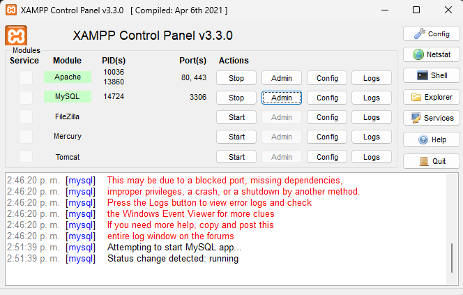
- **Acción:** Start en Apache y MySQL desde XAMPP Control Panel v3.3.0.
- **Resultado:** ambos módulos en verde; Apache en los puertos 80 y 443, MySQL en el 3306. El registro muestra `Status change detected: running`.
- **Observación:** el registro conserva mensajes en rojo de un primer intento fallido de iniciar MySQL (2:46:20 p. m.); al reintentar (2:51:39 p. m.) inició correctamente, como indica la guía.
- **Por qué demuestra que funciona:** los dos servicios necesarios para la clase están en ejecución.

---

## 4. Configuración del PATH de PHP

PATH es una variable de entorno con las carpetas donde Windows busca ejecutables. Al agregar `C:\xampp\php` se puede escribir `php` desde cualquier carpeta. Procedimiento: `Windows + R` → `SystemPropertiesAdvanced` → Variables de entorno → Path → Editar → Nuevo → `C:\xampp\php`. Después se abre una terminal **nueva**.

### Evidencia 2 — PATH con PHP y Composer
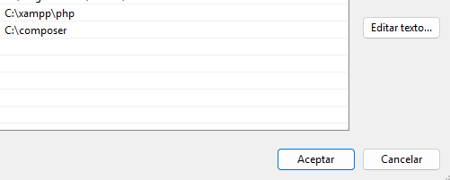
- **Resultado:** la lista incluye `C:\xampp\php` y `C:\composer`.
- **Por qué demuestra que funciona:** el PHP de XAMPP quedó registrado en el sistema.

### Evidencia 3 — Ubicación y versión de PHP
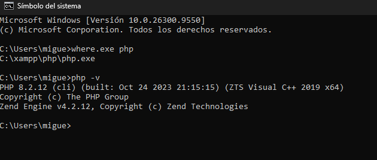
- **Comandos:** `where.exe php` y `php -v`.
- **Resultado:** ruta `C:\xampp\php\php.exe` y PHP 8.2.12 (cli).
- **Por qué demuestra que funciona:** la ruta apunta a XAMPP, como exige la guía, y la versión es la real del equipo.

---

## 5. php.ini y extensiones de PHP

`php.ini` es el archivo de configuración de PHP (extensiones, memoria, zona horaria, límites). Antes de modificarlo se confirma cuál lee PHP con `php --ini`. Laravel necesita activas:

- `openssl`: funciones criptográficas y comunicaciones seguras.
- `pdo_mysql`: conexión de PHP con MySQL/MariaDB mediante PDO.
- `mbstring`: cadenas multibyte (tildes, ñ).
- `fileinfo`: identificación de tipos de archivo.
- `zip`: soporte de archivos comprimidos usado por las dependencias.

**Error frecuente:** no duplicar extensiones; debe haber una sola línea activa por extensión (si no, aparece `already loaded`). Tras editar: guardar, reiniciar Apache y abrir terminal nueva.

### Evidencia 4 — php.ini activo y módulos (parte 1)
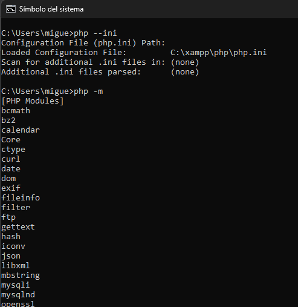
- **Comandos:** `php --ini` y `php -m`.
- **Resultado:** archivo cargado `C:\xampp\php\php.ini`; se ven `fileinfo`, `mbstring`, `mysqli`, `mysqlnd`, `openssl`, entre otras.

### Evidencia 5 — Módulos (parte 2)
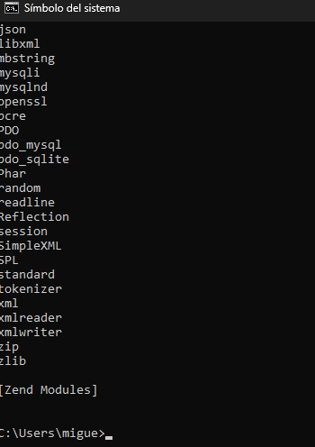
- **Resultado:** aparecen `PDO`, `pdo_mysql` y `zip`.
- **Por qué demuestra que funciona:** junto con la evidencia 4 quedan confirmadas las seis extensiones requeridas.

---

## 6. Instalación de Composer

Composer es el gestor de dependencias de PHP; Laravel lo usa para descargar sus paquetes. Se descargó `Composer-Setup.exe` desde getcomposer.org y se seleccionó `C:\xampp\php\php.exe` cuando el asistente pidió el ejecutable de PHP.

### Evidencia 6 — Composer instalado
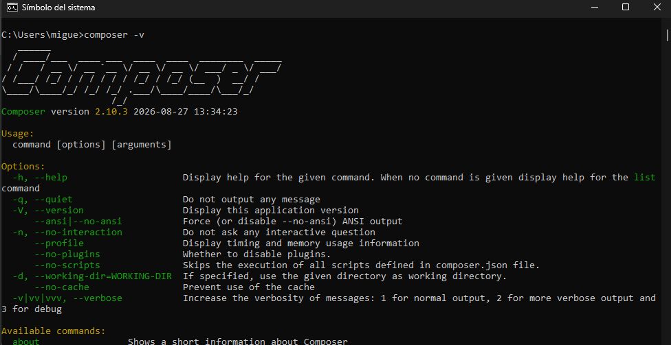
- **Comando:** `composer -v` (la guía pide `-V`; ambos muestran la versión, y `composer -V` aparece en la evidencia 9).
- **Resultado:** Composer version 2.10.3 (2026-08-27).
- **Por qué demuestra que funciona:** el comando responde desde cualquier carpeta, por lo que quedó en el PATH.

---

## 7. Instalación de Git

Git es un sistema distribuido de control de versiones: registra cambios, crea commits, recupera versiones y trabaja con repositorios remotos. Se descargó Git for Windows desde git-scm.com con las opciones recomendadas.

### Evidencia 7 — Git instalado
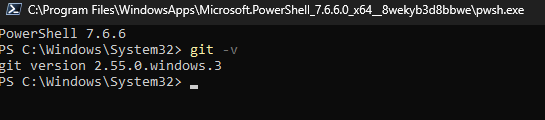
- **Comando:** `git -v` (equivale a `git --version`).
- **Resultado:** `git version 2.55.0.windows.3`.

---

## 8. Instalación de Visual Studio Code

Editor para escribir PHP, Blade y configuraciones. Se descargó desde code.visualstudio.com y se habilitó agregar VS Code al PATH para usar `code .` desde la terminal.

### Evidencia 8 — VS Code instalado
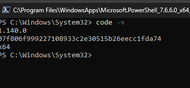
- **Comando:** `code -v`.
- **Resultado:** versión 1.140.0 (x64).

---

## 9. Verificación global del entorno

Antes de crear Laravel se verifica todo el entorno: cada verificación confirma que la instalación fue exitosa y que la terminal encuentra el comando.

### Evidencia 9 — Verificación global
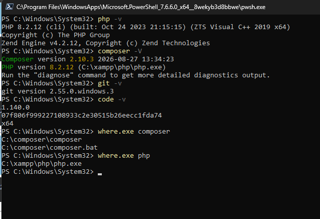
- **Comandos:** `php -v`, `composer -V`, `git -v`, `code -v`, `where.exe composer`, `where.exe php`.
- **Resultado:** todas las herramientas responden; Composer reporta `PHP version 8.2.12 (C:/xampp/php/php.exe)`.
- **Por qué demuestra que funciona:** PHP, Composer, Git y VS Code funcionan y Composer usa el PHP de XAMPP.

---

## 10. Creación del proyecto Laravel y Artisan

```bash
cd %USERPROFILE%\Documents
composer create-project laravel/laravel gestor-adso
cd gestor-adso
php artisan --version
```

`artisan` es la consola de Laravel y está en la raíz del proyecto: en `php artisan migrate`, `php` ejecuta el intérprete, `artisan` la consola de Laravel y `migrate` la tarea. Por eso solo funciona dentro de la carpeta del proyecto.

### Evidencia 10 — Laravel instalado
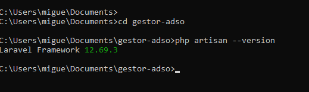
- **Resultado:** `Laravel Framework 12.69.3`.
- **Por qué demuestra que funciona:** el proyecto existe y Artisan arranca con el PHP configurado.

---

## 11. Archivo .env y APP_KEY

`.env` guarda la configuración del entorno (base de datos, URL, claves). Puede contener información sensible, por eso **no se sube al repositorio**. `APP_KEY` es la clave que Laravel usa para cifrar sesiones, cookies y datos.

```bash
copy .env.example .env
php artisan key:generate
```

Configuración de la base de datos en `.env`:

```env
DB_CONNECTION=mysql
DB_HOST=127.0.0.1
DB_PORT=3306
DB_DATABASE=gestor_adso
DB_USERNAME=root
DB_PASSWORD=
```

> Contraseña vacía solo por ser entorno local/educativo. No usar en producción.

### Evidencia 11 — .env y APP_KEY
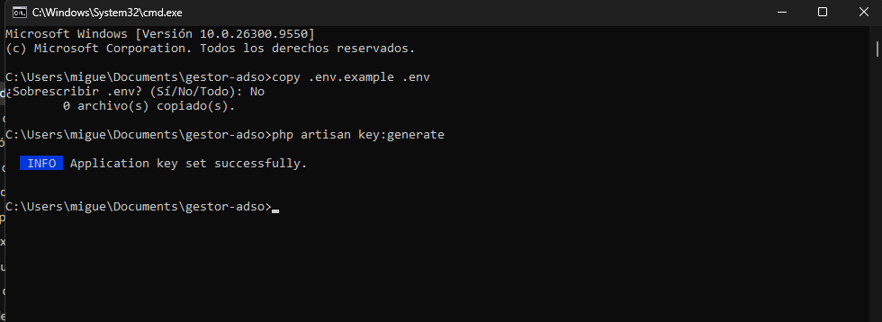
- **Resultado:** Windows preguntó `¿Sobrescribir .env?` y se respondió No (0 archivos copiados), porque el `.env` ya existía: Composer lo crea al generar el proyecto. Luego Artisan respondió `Application key set successfully`.
- **Por qué demuestra que funciona:** el proyecto tiene su `.env` y una `APP_KEY` válida.

---

## 12. Creación de la base de datos gestor_adso

Laravel necesita que la base exista antes de crear las tablas. Con MySQL iniciado, se crea desde phpMyAdmin (nombre `gestor_adso`, cotejamiento `utf8mb4_unicode_ci`) o por consola:

```sql
CREATE DATABASE gestor_adso
  CHARACTER SET utf8mb4
  COLLATE utf8mb4_unicode_ci;
```

`utf8mb4` almacena correctamente tildes, ñ y emojis. El nombre debe coincidir con `DB_DATABASE`. La base aparece en el panel izquierdo de phpMyAdmin en la evidencia 14.

---

## 13. Migraciones

Las migraciones son archivos (`database/`) que describen las tablas. Al ejecutarlas, Laravel las crea en `gestor_adso`. Antes se limpia la caché de configuración para que lea el `.env` actual.

```bash
php artisan config:clear
php artisan migrate
```

### Evidencia 12 — Error: Artisan no encuentra el archivo
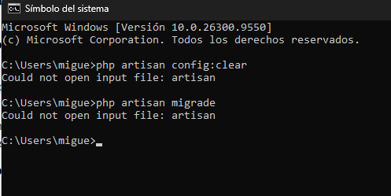
- **Comandos:** `php artisan config:clear` y `php artisan migrade`, desde `C:\Users\migue`.
- **Resultado:** `Could not open input file: artisan`.
- **Causa:** `artisan` está en la raíz del proyecto y los comandos se ejecutaron fuera de `gestor-adso`; además `migrade` tiene un error de tipeo (es `migrate`).
- **Solución:** entrar con `cd Documents\gestor-adso` y repetir los comandos.

### Evidencia 13 — Limpieza de caché y migraciones
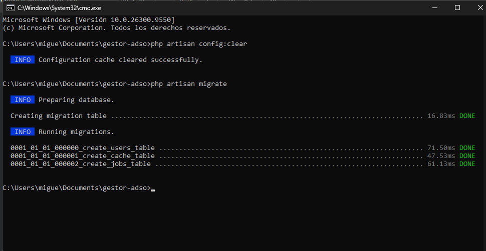
- **Resultado:** `Configuration cache cleared successfully` y migraciones `create_users_table`, `create_cache_table` y `create_jobs_table` en **DONE**.
- **Por qué demuestra que funciona:** Laravel se conectó a la base y creó las tablas.

### Evidencia 14 — Tablas en phpMyAdmin
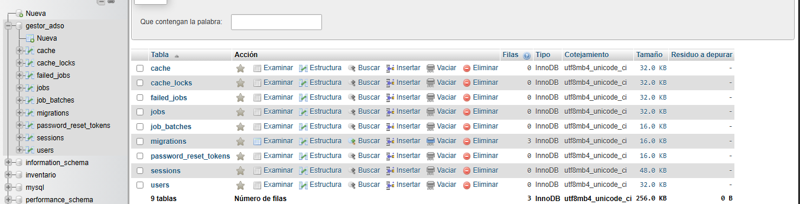
- **Resultado:** `gestor_adso` tiene 9 tablas (`cache`, `cache_locks`, `failed_jobs`, `jobs`, `job_batches`, `migrations`, `password_reset_tokens`, `sessions`, `users`), todas InnoDB con cotejamiento `utf8mb4_unicode_ci`. `migrations` registra 3 filas.
- **Por qué demuestra que funciona:** las 9 tablas provienen de las tres migraciones ejecutadas y confirman que Laravel usa MySQL/MariaDB.

---

## 14. Levantar el servidor de desarrollo

```bash
php artisan serve
```

Inicia el servidor local de Laravel, normalmente en `http://127.0.0.1:8000`. La terminal queda ocupada; para otros comandos se abre una segunda terminal dentro de `gestor-adso`. Si el puerto está ocupado, se lee la dirección real que muestra la terminal.

### Evidencia 15 — Laravel en el navegador
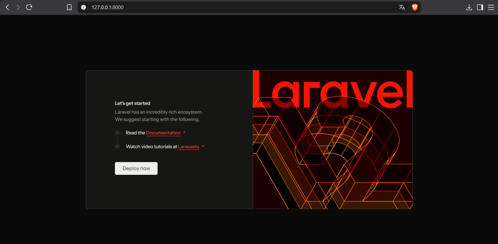
- **Resultado:** pantalla de bienvenida de Laravel en `127.0.0.1:8000`.
- **Por qué demuestra que funciona:** la aplicación responde correctamente desde el servidor local.

---

## 15. Abrir el proyecto en VS Code

```bash
code .
```

El punto representa la carpeta actual. Desde ahora se trabaja siempre sobre `gestor-adso`.

### Evidencia 16 — Proyecto en VS Code
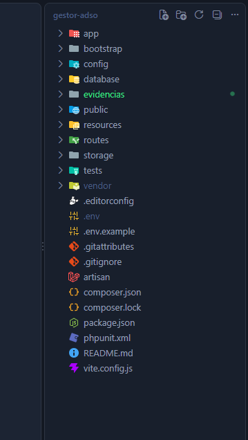
- **Resultado:** el explorador muestra `app`, `bootstrap`, `config`, `database`, `public`, `resources`, `routes`, `storage`, `tests`, `vendor`, `.env`, `artisan`, `composer.json`, `README.md` y la carpeta `evidencias`.
- **Observación:** `.env` y `vendor` aparecen atenuados: Git los ignora según `.gitignore`, así que no se suben al repositorio.

---

## 16. Control de versiones con Git y GitHub

`git init` crea el repositorio local, `git add .` prepara los cambios y `git commit` registra un punto en la historia.

```bash
git status
git init
git add .
git commit -m "Semana 1: Entorno listo + Laravel base"
```

### Evidencia 17 — Repositorio en GitHub
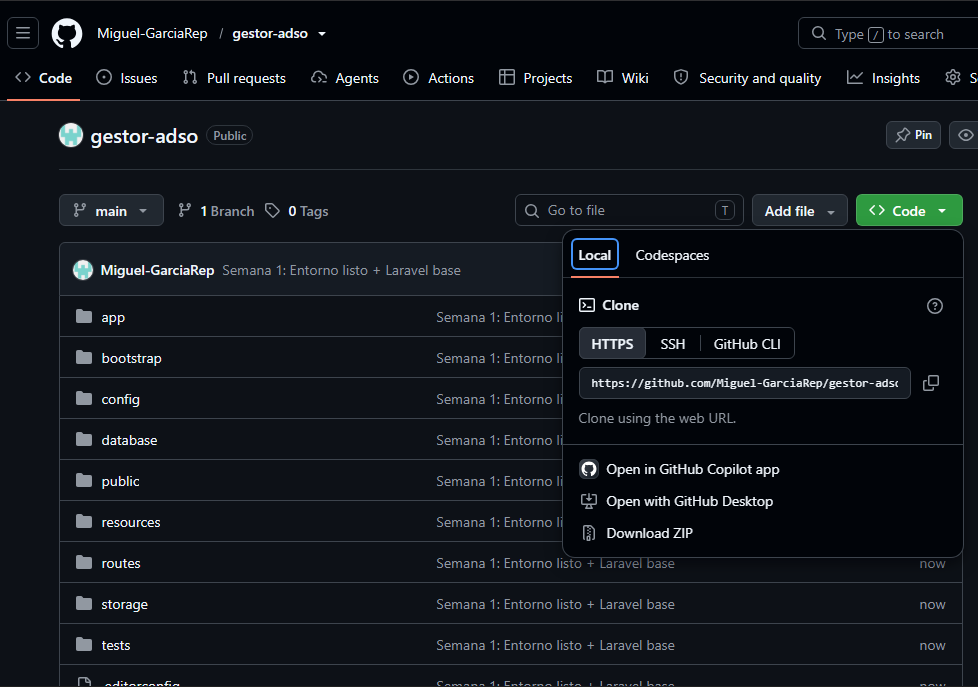
- **Resultado:** repositorio público `Miguel-GarciaRep/gestor-adso` con la estructura de Laravel y el commit **"Semana 1: Entorno listo + Laravel base"**.
- **Por qué demuestra que funciona:** el control de versiones está activo desde el primer día.

---

## 17. Problemas encontrados

| Problema | Causa | Solución |
|---|---|---|
| `Could not open input file: artisan` (evidencia 12) | Comando ejecutado fuera de la carpeta del proyecto y con un error de tipeo (`migrade`) | Entrar a `gestor-adso` y ejecutar `php artisan migrate` (evidencia 13) |

---

## 18. Checklist final — Semana 1

| Ítem | Estado | Evidencia |
|---|---|---|
| XAMPP instalado; Apache y MySQL disponibles | ✅ | 1 |
| PHP funciona (`php -v`) | ✅ | 3, 9 |
| PHP apunta a `C:\xampp\php` | ✅ | 2, 3, 9 |
| Extensiones requeridas habilitadas | ✅ | 4, 5 |
| Composer funciona | ✅ | 6, 9 |
| Git funciona | ✅ | 7, 9 |
| VS Code funciona | ✅ | 8, 9 |
| `gestor-adso` creado | ✅ | 10, 17 |
| Artisan funciona | ✅ | 10 |
| `.env` configurado y APP_KEY generada | ✅ | 11 |
| BD `gestor_adso` creada | ✅ | 14 |
| Migraciones ejecutadas | ✅ | 13 |
| Tablas visibles en phpMyAdmin | ✅ | 14 |
| Laravel abre en el navegador | ✅ | 15 |
| Proyecto abierto en VS Code | ✅ | 16 |
| Repositorio Git con primer commit | ✅ | 17 |
| Evidencias documentadas | ✅ | 1 a 17 |

El entorno está listo para continuar con la Semana 2 del proyecto Gestor ADSO.
